# WiFi Connect

A small app for **iPhone and Android** that signs you in to your school's Wi-Fi login page with your student ID and password, so you don't have to type them every time you get to campus.

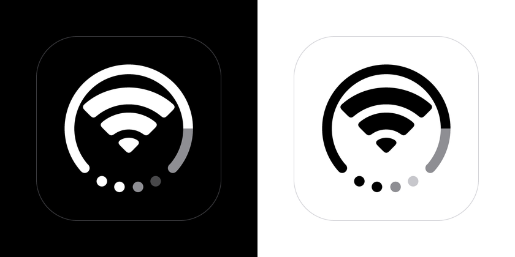

Set up for **UTAR's `utarwifi`** out of the box, and works with other campuses too.

- **One tap:** open the app and tap the big Wi-Fi circle to connect. Opening the app also tries to sign in on its own.
- **Fully automatic:** on Android the app signs in by itself whenever you join the school Wi-Fi. On iPhone you set up a Shortcuts automation once.
- **"Connected to utarwifi" notification** when the app signs you in on arrival.
- **Every building:** each block's login page can sit at a different address. The app finds the right one each time.
- **Private:** your student ID and password are stored encrypted on your phone and are only sent to your school's login page.
- **Apple-style design:** a clean layout on both phones, with Light, Dark or System appearance (☀️ / 🌙 button), and an icon that follows Dark Mode.
- **Your language:** English, Bahasa Melayu, 简体中文 (Simplified Chinese), 日本語 (Japanese) and தமிழ் (Tamil), chosen in Settings › Language.
- **Tested:** every change is checked by signing in through both apps and the Windows tool against a mock campus login page.

### Features

| Feature | iPhone | Android |
| --- | --- | --- |
| **Sign in without opening the app** | Home Screen / Lock Screen widget, and a Control Center button (iOS 18) | Quick Settings tile and a Home Screen widget |
| **Stay signed in** | Background check, timed by iOS | Checks every 15 minutes |
| **Laptop sign-in** | `windows/Install.cmd` signs your Windows laptop in to `utarwifi` too | |
| **Sign-in history** | Settings › Sign-In History, with **Copy Diagnostics** to send if something goes wrong | Same |
| **App lock** | Face ID / Touch ID before showing Settings | Fingerprint, face or screen lock |
| **Disconnect** | Tap the big circle again when connected | Same |
| **Speed test** | A full test page: live gauge, ping, jitter, download and upload over the Wi-Fi | Same |
| **Languages** | English, Bahasa Melayu, 简体中文, 日本語 and தமிழ், changed in Settings › Language (or follows the phone) | Same |
| **Share with classmates** | Settings › Share Setup: a QR code they scan with their camera (no password included) | Same, plus pasting a shared link |

| | iPhone | Android |
| --- | --- | --- |
| Main screen | 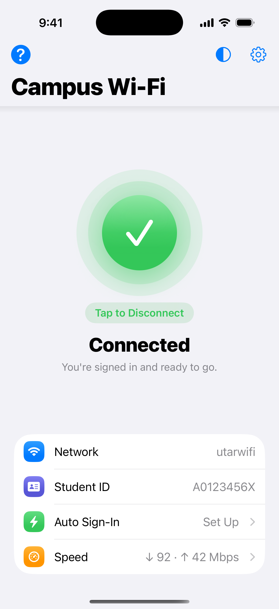 | 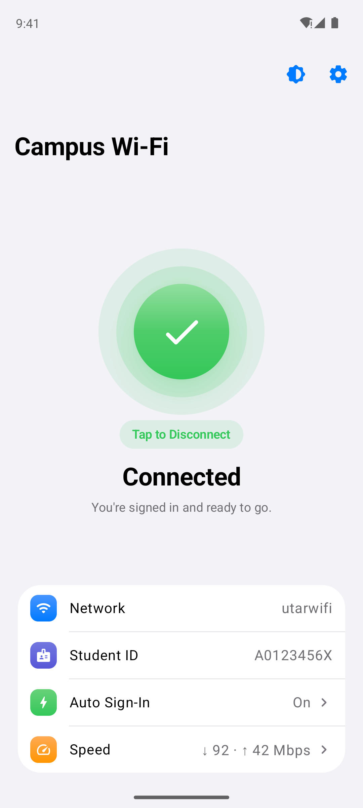 |
| Settings | 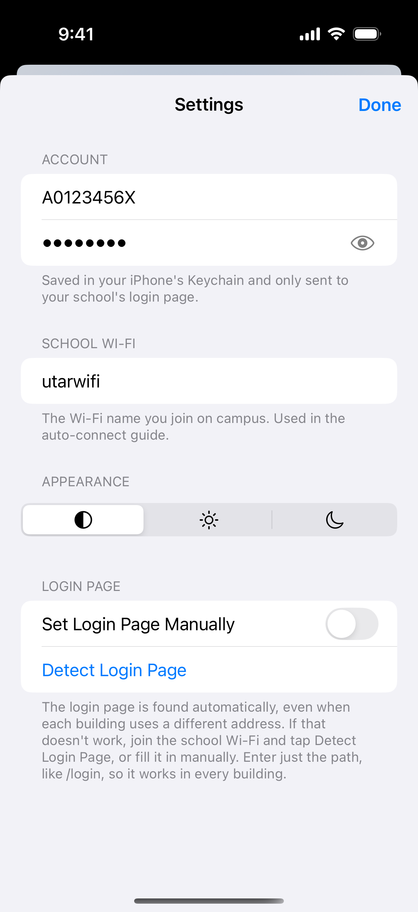 | 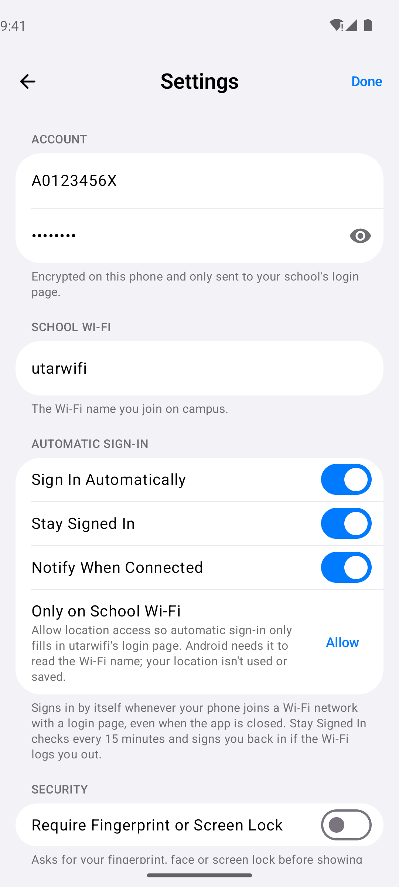 |
| Sign-in history | 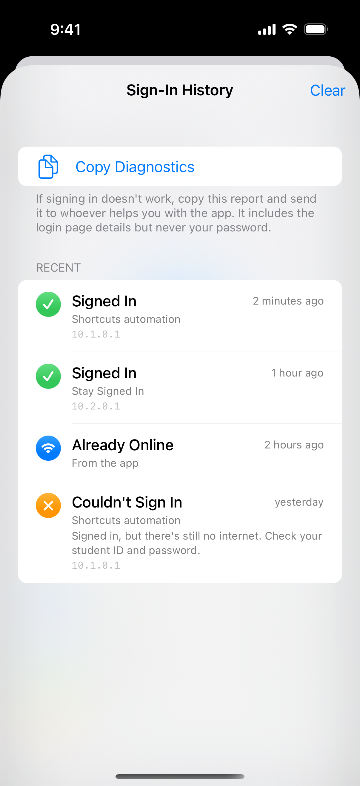 | 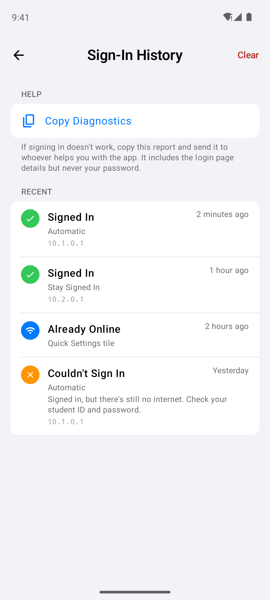 |
| Share with friends | 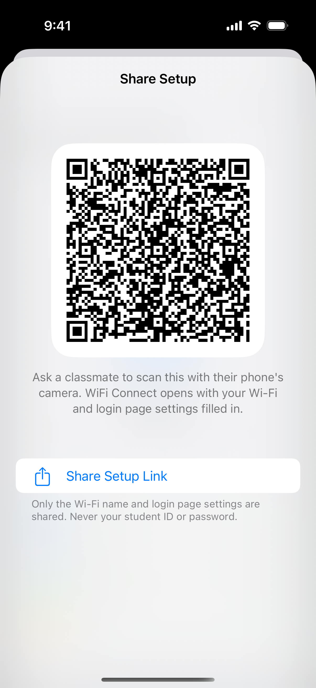 | 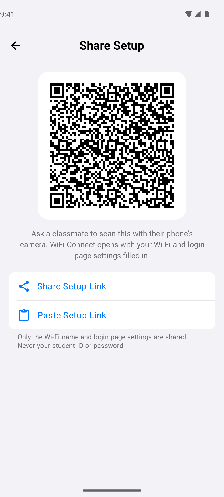 |
| Speed test | 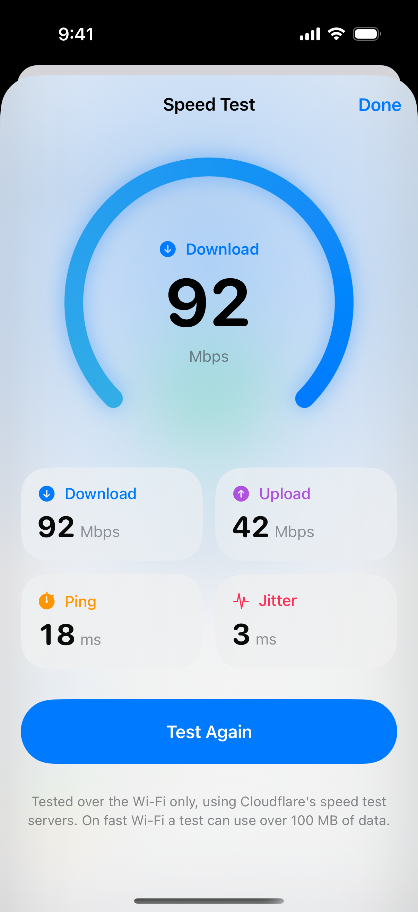 | 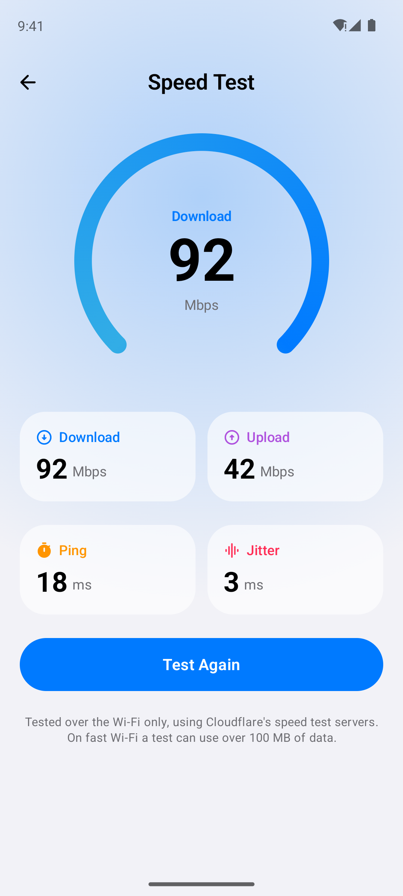 |
| 日本語 | 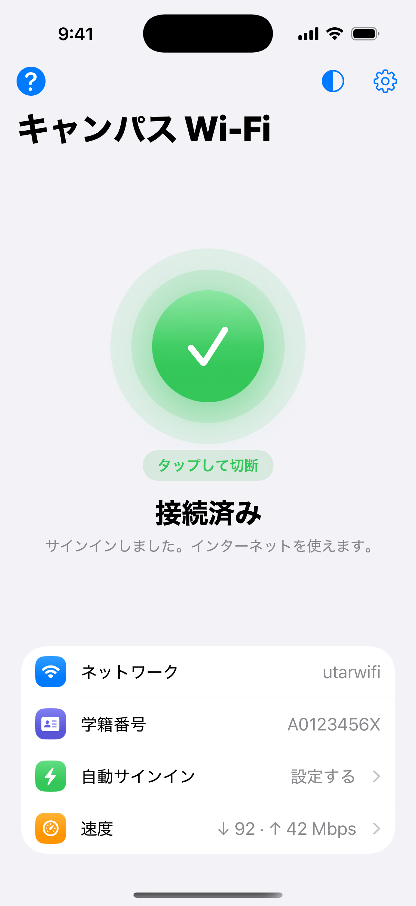 | 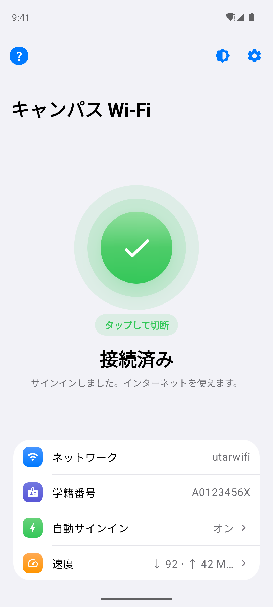 |
| தமிழ் | 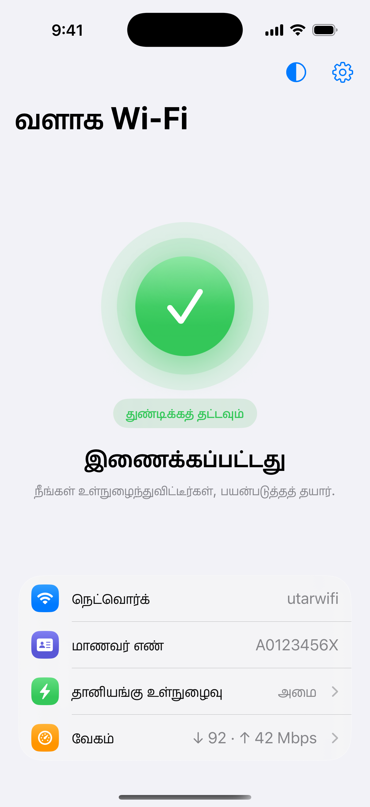 | 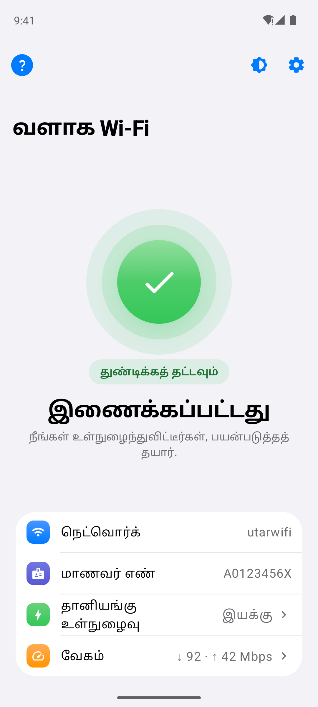 |

Requires iOS 17 or later, or Android 9 or later.

## Install

**📖 Full step-by-step guide, with troubleshooting: [docs/INSTALL.md](docs/INSTALL.md)**

The short version:

| | Android | iPhone |
| --- | --- | --- |
| **Get the file** | **Actions › Build Android app ›** newest ✅ run **› WifiConnect-apk** | **Actions › Build iPhone app ›** newest ✅ run **› WifiConnect-ipa** |
| **Install** | Open `WifiConnect.apk` on the phone and allow **Install unknown apps** | Use [Sideloadly](https://sideloadly.io) on Windows (or Xcode on a Mac) with your Apple ID |
| **First time** | Set battery to **Unrestricted** so auto sign-in keeps working | Turn on **Developer Mode** and trust your Apple ID under **VPN & Device Management** |
| **Keep it working** | Nothing to do | Renew every 7 days with a free Apple ID |
| **Auto sign-in** | Built in, on by default | A Shortcuts automation for `utarwifi` |

**Windows laptop too:** download this repository as a ZIP and double-click `windows/Install.cmd`. Your laptop then signs in to `utarwifi` by itself. See [docs/INSTALL.md](docs/INSTALL.md#windows-laptop).

## iPhone alternative with nothing to install: a Shortcuts automation

If you'd rather not install anything, the Shortcuts app can send the login form by itself. This works for most simple login pages, but not ones that add a new security token each time. It also stores your password in the shortcut as plain text.

**Find the login details on your Windows laptop (once, on campus):**

1. Join the school Wi-Fi on your laptop. The login page should open in Chrome or Edge. If it doesn't, go to `http://neverssl.com`.
2. Press **F12**, open the **Network** tab and tick **Preserve log**.
3. Log in as usual. In the list, click the first request whose **Method** is `POST`, usually named something like `login`.
4. Write down the **Request URL** from **Headers**. Then open **Payload** and write down every field name and value, such as `username`, `password` or `submit`.

**Create the automation on your iPhone:**

1. Open **Shortcuts** › **Automation** › **+** › **Wi-Fi**, pick the school network and select **Run Immediately**. Tap **Next**, then **New Blank Automation**.
2. Add the action **Get Contents of URL** and paste the Request URL.
3. Tap **▸** (Show More) to expand it. Set **Method** to **POST** and **Request Body** to **Form**.
4. Add one field for each entry you wrote down. Use your student ID and password for those two fields.
5. Tap **Done**. Next time you join the school Wi-Fi, your iPhone logs in by itself.

## Set it up on iPhone

1. Open **WiFi Connect** and enter your **student ID** and **password**.
2. Enter your school's **Wi-Fi name**. It's used in the setup guide.
3. On campus, join the school Wi-Fi and tap the big Wi-Fi circle (**Tap to Connect**).

### Sign in automatically

In the app, tap **Set Up Auto-Connect** for a step-by-step guide. In short:

1. Open **Shortcuts** › **Automation** › **+**.
2. Choose **Wi-Fi** and pick your school network, then select **Run Immediately**.
3. Add the action **Log In to Campus Wi-Fi** (from WiFi Connect).

To stop iOS from showing the login popup as well, go to **Settings › Wi-Fi**, tap **ⓘ** next to the school network and turn off **Auto-Login**.

## If automatic detection doesn't work

The app finds your school's login form the same way iOS does: it loads `captive.apple.com`, follows the redirect to the login page and fills in the form. Some portals build their login page entirely in JavaScript, and those need to be set up by hand:

1. Join the school Wi-Fi (don't sign in yet), open **Settings** in the app and tap **Detect Login Page**. If the form is found, the details are filled in for you.
2. Otherwise, turn on **Set Login Page Manually** and fill in:
   - **URL:** where the form is submitted.
   - **Method:** usually `POST`.
   - **ID Field / Password Field:** the `name` attributes of the student ID and password boxes.
   - **Extra fields:** any other `name=value` pairs the portal needs, one per line.

   To find these values, follow **Find the login details on your Windows laptop** above.

### Different buildings, different addresses

Many campuses, including UTAR, give each block its own login page address (for example `10.1.x.x` in one block and `10.2.x.x` in another). Automatic mode handles this: the app never saves an address. It asks the network for its login page every time, like your phone does. If you use manual settings, enter just the path (for example `/login`) rather than a full address, and it will work in every building.

### What if my school Wi-Fi asks for my ID in a system popup, not a web page?

That's a WPA2/WPA3-Enterprise (802.1X) network, such as eduroam. iOS saves those credentials after you enter them once, and signs in automatically from then on, so you don't need this app. If iOS keeps asking, go to **Settings › Wi-Fi**, tap **ⓘ** › **Forget This Network**, then join again, enter your ID and password, and tap **Trust** when the certificate appears.

## Project layout

| Path | Purpose |
| --- | --- |
| `ios/` | iPhone app (SwiftUI). `PortalLogin.swift` signs in, `HTMLForm.swift` reads the login page, and `LogInIntent.swift` adds the Shortcuts action. |
| `android/` | Android app (Kotlin + Jetpack Compose). `PortalLogin.kt` signs in, `HtmlForm.kt` reads the login page, and `AutoLogin.kt` signs in automatically when you join a network. |
| `windows/` | Auto sign-in for a Windows laptop (PowerShell): `Install.cmd`, `Uninstall.cmd` and `WifiConnect.ps1`. |
| `.github/workflows/` | Builds the iPhone `.ipa` and Android `.apk`, runs the tests and takes the screenshots. |
| `scripts/mock_portal.py` | A mock campus login page with two buildings, used by the **Test** workflow (`scripts/*-e2e.sh`). |
| `scripts/i18n.py` | All translations (English, Malay, Chinese; Japanese and Tamil in `i18n_more.py`) for both apps. Edit the tables, then run it to regenerate the string files. |
| `scripts/make_app_icon.py` | Draws the app icon (light, dark and tinted) for both apps. |
| `screenshots/` | Screenshots of both apps, taken automatically in the iOS simulator and Android emulator. |
